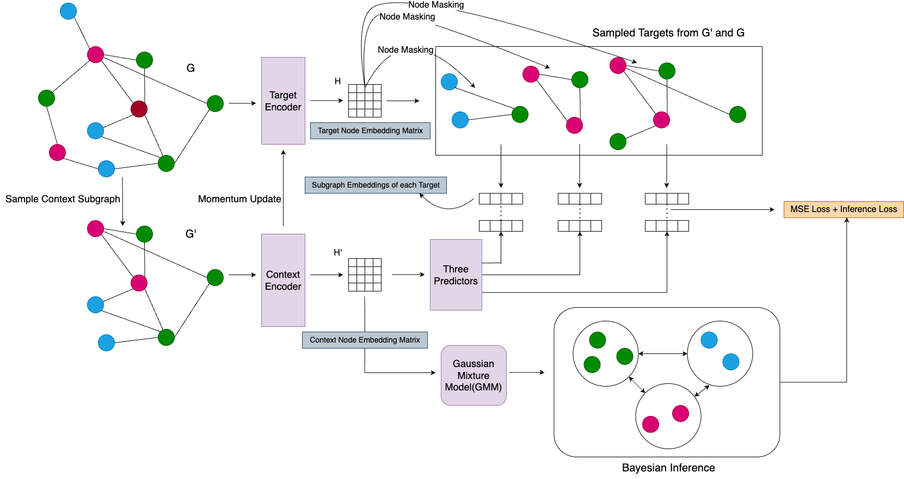

# JPEB-GSSL
Official code of our paper "Leveraging Joint Predictive Embedding and Bayesian Inference in Graph Self Supervised Learning". The preprint can be found <a href="https://arxiv.org/abs/2502.01684">here</a>.

## Running the scripts
- Create a Python(preferrably >3.10) virtual environment and activate it. Run the following command
```sh
pip install -r requirements.txt
```
- Create a ```.env``` file and set the values of all environment variables. 
- Download datasets by running ```embedding/download_data.py```
- To train node embeddings, run the scripts in the ```embedding```folder. ```train.py``` trains embeddings without Bayesian Inference and ```train_gmm.py``` uses Bayesian Inference.
- To test the embeddings on node classification, you may run the following scripts in the ```classification``` directory:
- 1) Run ```train_backbone_frozen.py``` to train only the classifier head keeping the backbone frozen. We report these scores in our paper.
- 2) Run ```train.py``` to update the weights of the backbone as well. 
- 3) Similarly ```test_backbone.py``` and ```test.py``` runs node classification tests on frozen and online backbones respectively.
- To test the embeddings on node clustering and plot them, run ```cluster_nodes.py``` in the ```node_clustering``` directory.
- To perform tests such as augmenting node features with noise etc, run the ```test.py``` script in the ```abnormal_features``` directory.
- To perform evaluations on OOD data during test time, run the ```test.py``` script in the ```tta``` directory.
- The ```analysis_plots``` directory contains node clustering results, loss curves and embedding spread plots. You may generate the plots by running the scripts ```momentum_study.py``` and ```embedding_spread.py``` in the same directory.
  
## Dependencies
```sh
torch
torchvision
python-dotenv
torch-geometric
torchmetrics
pytorch-lightning
scikit-learn
numpy
scipy
python-dotenv
matplotlib
wandb
os
```

## Bugs/Queries
If there are any bugs, you may raise an issue using the standard issue template. If there are any technical questions regarding the project, you may email me at smudge0110@icloud.com.
